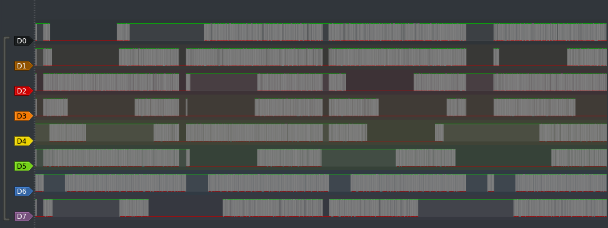

# EmSys Lab1
Welcome to the first EmSys Labs.

This lab consists of a number of exercises:
* _"What is your secret word?"_ -- where you will use pulseview to determine the secret word your ESP32 is transmitting. 
* _"Hello World!"_  -- where you will program your ESP32 to send a UART message of your own.
* _"Square Wave Generator"_ -- where you will generate square waves as fast as you can and calculate the arduino library overheads.
* _"dotDevice"_ -- where you will interact with your virtual dotDevice on the centralised EmSys webserver via WebSockets.
 
This lab aims to familiarise you with:
* The Arduino IDE and it's overheads
* Capturing waveforms from the logic analyser in PulseView
* Timing issues in embedded systems
* WebSockets and communications between embedded devices

[[A list of useful acronym and terms can be found here](https://github.com/STFleming/EmSys_Lab1/tree/main/acronyms)]

----------------------------
### Submission guide
__TODO:__ _logbook format_

### How your LA and ESP32 are connected


Each of the pins next to the TinyPico correspond to GPIO pins in [[this diagram (upsidedown)](https://raw.githubusercontent.com/STFleming/EmSys/main/imgs/tinypico-specs-v2.jpg)].

-----------------------------
### What is your secret word?
All the ESP32 devices in the lab have been preloaded with a program that is sending a unique word for each group over some UART pins. Your task here is to find out what your groups unique word is using your LA and PulseView.

1. Open PulseView ```pulseview``` and capture a trace. [[video guide: capturing a trace with pulseview](https://youtu.be/nhTuqYAT4OI)]

Your trace should look something similar to this.


2. Examine the signals on your waveform, try and identify which signals you think might be a UART Tx signal. All the other signals are randomly changing. The UART Tx channel will be regularly repeating the same word in ASCII. 
3. Using the PulseView low-level protocol decoder decode the signal that you think is trasmitting your secret word. [[video guide: using the pulseview low-level protocol decoder](https://youtu.be/hBrg0VJTNWA)].
4. Write your secret word in your logbook.

_Tips_: 
* _Only common Baud rates are used. The UART Tx pin will be transimitting at only one of the following baudrates: 9600, 38400, and 115200_
* _You do not know the baud rate of the signal you are trying to intercept, this may require trial and error to find the correct parameter_
* _However, you have 8 data bits, and no parity bits._

UART was discussed in the first lecture briefly, if you'd like to review the first lecture the recording is available [[here](https://swanseauniversity.zoom.us/rec/share/R7U9ldmf8-D5dC1GzypI1Fmygk_uMk0AHLJSNAJh9jKzSaDWy91D_K8dqezqFnjf.dxRs8jgIIbZQ9eEK )] ``<passcode: Rq7!2vJ7>``. A nice more detailed discussion of the UART protocol can be found [[here](https://www.circuitbasics.com/basics-uart-communication/)]. 

### Hello World! 
In the Lab1 git repository there is some code that will print out ``HelloWorld`` on pin 23 of the TinyPico which is connected to channel D0 on your LA. [[link to the code](https://github.com/STFleming/EmSys_Lab1/blob/main/src/HelloWorld/HelloWorld.ino)] 

Do the following, recording what your doing in your logbook:
1. Modify the code to print a message of your choice
2. Compile and upload the code to your board.
If you have decided to try the command line option for compilation and upload then simply type into your command prompt: ``make HelloWorld``
This command will compile your sketch and upload your modified code.
However, if you feel more comfortable using the Arduino IDE then you can follow [[this video tutorial]()].
3. Use the pulseview low-level protocol decoder to capture the message you are printing and include a screenshot in your logbook. 
--------------------
### Square Wave Generator

Next you are going to use Arduino to generate square waves from your device and measure the maximum possible frequency. In the second lecture I explained the following which will be useful for this lab:
* The basic structure of an Arduino sketch i.e. what the ``setup()`` and ``loop()`` functions do.
* How to drive an output pin ``HIGH`` and ``LOW`` using ``digitalWrite()`` [[Arduino digitalWrite documentation](https://www.arduino.cc/reference/en/language/functions/digital-io/digitalwrite/)].
* How to make your tinyPico wait using ``delay()`` and ``delayMicroseconds()`` [[Arduino Delay Documentation](https://www.arduino.cc/reference/en/language/functions/time/delay/)].
* What a pointer is, the address map of the TinyPico, and how we interact with hardware through pointers.

If you missed the lecture or want to recap these, the recording is available [[here]()] ``<passcode: >``.

Now you will put all that knowledge to good use testing the limits of your board.

1. Using ```digitalWrite(pin, HIGH|LOW)``` write code to generate a square wave with the highest frequency you possible can. 
2. Using your LA measure this maximum frequency and report it in your logbook. 
3. Do you notice anything unusual about the output? Run a resonable length capture to maybe see something strange (1M samples at 24MHz). Comment on what you think might be causing this?
4. Modify your code above to generate two square waves with as fast a frequency as possible. What is the new maximum frequency? If it has changed comment on why you think that is the case?
5. Using the captured trace from 4. (the item above), estimate the time a ```digitalWrite()``` function call takes, and estimate the ```loop()``` overheads.
6. Use your estimates to calculate what you expect the maximum frequency can be when generating three square waves.
7. Modify your code to generate three square waves and measure the maximum possible frequency, how close was your estimation in 6.?

The Arduino IDE abstracts the underlying hardware with functions such as ```digitalWrite()```. 
These abstractions are useful, they make it easier for the developer to use, and they allow for the same API to be used on multiple different devices. 
However, such abstractions come at a cost in terms of performance. 
If we dive a little bit deeper, then we can improve the maximum frequency of our generator.

In the last lecture we examined the address map of our TinyPico device. 
We also looked into how we can use pointers to manipulate and interact with hardware registers. 
In the next challenge instead of using the Arduino function ```digitalWrite()``` to interact with the GPIO pins, 
I want you to use pointers and bit manipulation to directly interact with the hardware. 

In the [ESP32 Technical Reference Manual](https://www.espressif.com/sites/default/files/documentation/esp32_technical_reference_manual_en.pdf), on page 61, you will find the description of six hardware registers that can be used to control the GPIO pins. 

| Register name     | Address    | R/W | Width| Info |
|-------------------|------------|-----|-------|------|
| GPIO_ENABLE_REG    | 0x3FF44020 | R/W | 32  | bits 0-31 of this register can be set/cleared to enable/disable GPIOs 0-31 |
| GPIO_OUT_W1TS_REG  | 0x3FF44008 | WO  | 32  | setting bits 0-31 of this register will set the corresponding GPIOs (0-31) to go HIGH |
| GPIO_OUT_W1TC_REG  | 0x3FF4400C | WO  | 32  | setting bits 0-31 of this register will set the corresponding GPIOs (0-31) to go LOW      |
| GPIO_ENABLE1_REG   | 0x3FF4402C | R/W | 32  | bits 0-7 of this register can be set/cleared to enable/disable GPIOs 32-39 |
| GPIO_OUT1_W1TS_REG | 0x3FF44014 | WO  | 32  | setting bits 0-7 of this register will set the corresponding GPIOs (32-39) to go HIGH     |
| GPIO_OUT1_W1TC_REG | 0x3FF44018 | WO  | 32  | setting bits 0-7 of this register will set the corresponding GPIOs (32-39) to go LOW      |

_note: W1TS == "write 1 to set", W1TC == "write 1 to clear"_

To manipulate these registers we will need to use pointers and bitwise operations, for examples of bitwise operations see [[bitwise operations in c](https://en.wikipedia.org/wiki/Bitwise_operations_in_C)].
Remember to create a pointer to a specific address in C you can do the following:

```C
uint32_t *gpio_enable_reg = (uint32_t *)0xDEADBEEF; // creates a uint32_t pointer pointing at address 0xDEADBEEF
*gpio_enable_reg = 1; // sets bit 1 and 0 elsewhere
```

Do the following steps:
1. Using the registers listed above create a square wave on a single pin that oscillates at the highest frequency you can. You do not need to worry about it being an exact square wave, it doesn't need to have equal time spent HIGH or LOW per period. 
2. Record the maximum frequency in your logbook and take a screenshot of your pulseview trace.
3. Next write a sketch that generates six square waves all with the highest frequency possible. 
4. Record the maximum frequency of the six square wave signals in your logbook and take a pulseview screenshot.
5. Comment on how this is different from when you were using the Arduino ``digitalWrite()`` function. Why do you think this is the case?
6. Next write a sketch that generates eight square wave signals with the maximum frequency possible 
7. Record the maximum frequency and include a screenshot of pulseview in your logbook.
8. How has this changed from the sketch where six signals were generated, why do you think this is?

----------------------
### dotDevice -- Communicating with other embedded systems

In the final part of this lab we are going to use WebSockets to communicate with one of two central EmSys lab servers: 
* Server Address:```cs-s-fleming-pc.swan.ac.uk``` -- for devices physically located within the Foundry rooms 203/204. We will call this server __EmSysLocal__. 
* Server Address:```ec2-18-222-206-236.us-east-2.compute.amazonaws.com``` -- an Amazon Web Services (AWS) server for devices not physically located in the Foundry rooms 203/204, i.e. kits people have bought for use at home. We will call this server __EmSysRemote__.

Each of these central servers contains a virtual world, with a virtual embedded device for each of the lab groups on the course. This virtual embedded device is called a ``dotDevice`` and it has a data sheet that can be found [[here](https://github.com/STFleming/EmSys_dotDevice)].

You can make your dotDevice move around, change colour, change size, and say something. It also has some command memory and a timer, allowing you to load in a sequence and execute it. However, there is a strict protocol for interacting with your dotDevice, which you can find in the data sheet.

To view the virtual-labs open your browser and navigate to the following:

| __name__ |  __url__ | __info__  |
|---------|----------|-----------|
| __EmSysLocal__ | [http://cs-s-fleming-pc.swan.ac.uk:4000](http://cs-s-fleming-pc.swan.ac.uk:4000)   | For devices physically located within the Foundry rooms 203/204 __Must be connected to the VPN to view this page__    |
| __EmSysExternal__ | [http://ec2-18-222-206-236.us-east-2.compute.amazonaws.com:4000](http://ec2-18-222-206-236.us-east-2.compute.amazonaws.com:4000)   | For devices all other devices -- viewable from anywhere    |


To communicate with our dotDevice we will be using ArduinoWebSockets [[link](https://github.com/gilmaimon/ArduinoWebsockets)]. In [[src/WSHelloWorld_EmSysLocal]()] there is an example that sends a ``"Hello World!"`` message to the __EmSysLocal__ server with WebSockets that you can use as a base for communicating with your ``dotDevice``. There is also an example [[src/WSHelloWorld_EmSysExternal](https://github.com/STFleming/EmSys_Lab1/blob/main/src/WSHelloWorld_EmSysExternal/WSHelloWorld_EmSysExternal.ino)] for communicating with the __EmSysExternal__ server.  
Modify the example code to see if you can make it send a message to the chat section of your relevant server and see if you can spot it.

Once you have managed to send a message to your relevant server you need to look at the dotDevice datasheet and get it to complete the following tasks, recording them in your logbook. You should have already been assigned a unique ID for your dotDevice, if you are not sure what your unique dotDevice ID is please ask a question in the ``raise-your-hand`` Discord channel and a demonstrator will be of assistance. 

1. Make your dotDevice say something. Text must appear smoothly and not jitter.
2. Make your dotDevice do a dance.
3. Make your dotDevice change colour periodically. 
4. Keep your code in your logbook in section (src/dotDevice/task1)
5. Document your routine and challenges you found while developing it

If you are on __EmSysLocal__ you may have noticed that you dotDevice is not always very responsive due to the amount of WiFi traffic on the network. Similarily, for the __EmSysExternal__ folks the high variation in latencies when sending you commands to a server in Ohio America might be causing its behaviour to be irratic. Luckily the dotDevice is programmable and contains some onboard command memory.

1. Think about how you can use the onboard command memory of your dotDevice to improve it's performance, document your thoughts in your logbook.
2. Use the programmable memory of your dotDevice to program it to do the routine (or something similar) to the previous one keep, put your source code in (src/dotDevice/task2) of your logbook. 
